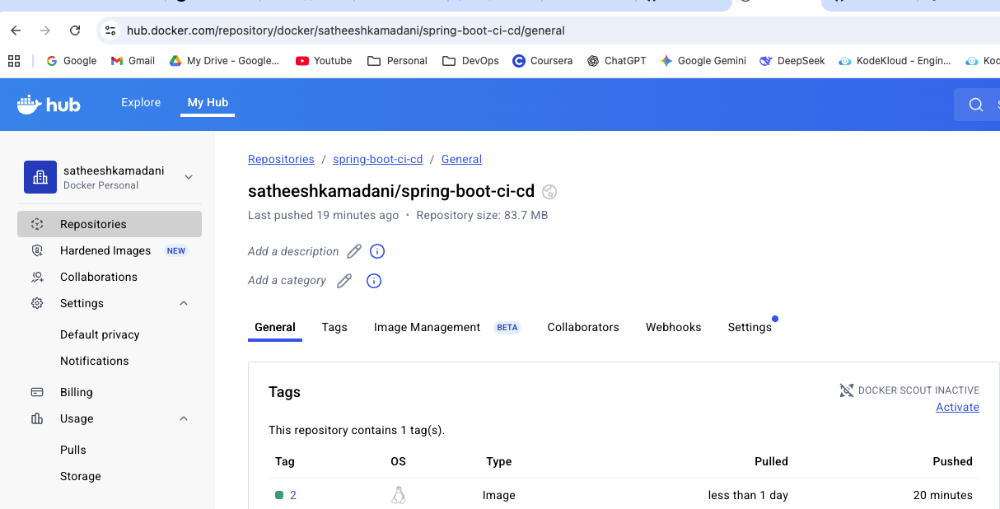
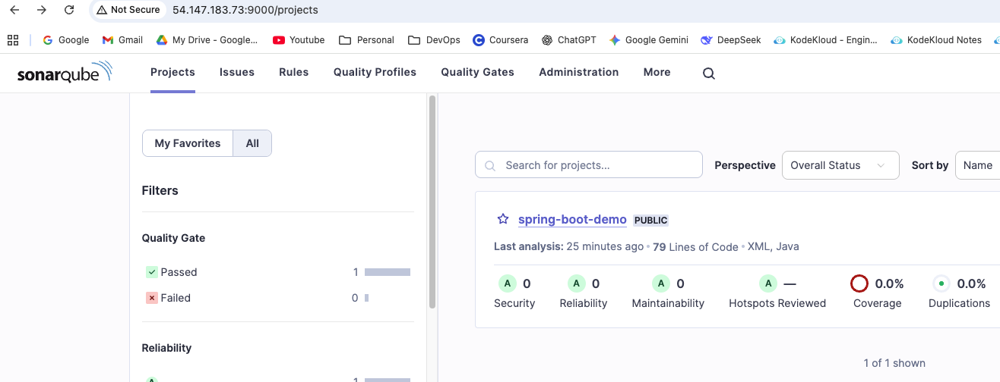

# End-to-End CI/CD Pipeline with Jenkins, SonarQube, Docker, ArgoCD & Kubernetes

This project demonstrates a complete CI/CD pipeline integrating Jenkins, SonarQube, Docker, ArgoCD, and Kubernetes for automating the build, test, and deployment lifecycle of a Spring Boot application

Architecture Diagram


## Screenshots

- Jenkins pipeline showing all the stages successful  
  

- Application Docker image pushed to Docker Hub  
  

- SonarQube static code analysis results for application  
  

Here are the step-by-step details to set up an end-to-end Jenkins pipeline for a Java application using SonarQube, Argo CD, Helm, and Kubernetes:

Prerequisites:

   -  Java application code hosted on a Git repository
   -  Jenkins server
   -  Kubernetes cluster(Minikube)
   -  Argo CD


Steps:

    1. Install the necessary Jenkins plugins:
       1.1 Git plugin
       1.2 Maven Integration plugin
       1.3 Docker Pipeline plugin
       1.4 Sonarqube scanner plugin

    2. Create a new Jenkins pipeline:
       2.1 In Jenkins, create a new pipeline job and configure it with the Git repository URL for the Java application.
       2.2 Add a Jenkinsfile to the Git repository to define the pipeline stages.

    3. Define the pipeline stages:
        Stage 1: Checkout the source code from Git.
        Stage 2: Build the Java application using Maven and run unit tests
        Stage 3: Run SonarQube analysis to check the code quality.
        Stage 4: Build a Docker image of the application and push it to DockerHub or any container registry.
        Stage 5: Use a shell script to update the Docker image tag in the deployment.yml

    4. Argo CD deployed application on to kubernetes cluster:
        4.1 Set up Minikube as your local Kubernetes cluster.
        4.2 Install Argo CD inside Minikube. 
        4.3 Configure Argo CD to watch the Git repository so that it automatically detects updated deployment manifest files and deploys the application to the Kubernetes cluster.

This end-to-end Jenkins pipeline will automate the entire CI/CD process for a Java application, from code checkout to production deployment, using popular tools like SonarQube, Argo CD and Kubernetes.

## How to Run

### 1. Clone the Repository
```bash
git clone https://github.com/satheesh-kamadani/jenkins-docker-argo-deployment.git
cd jenkins-docker-argo-deployment
```
### 2. Create an AWS EC2 Instance
Instance type: t2.large
Install the following tools:

### 3. Install Java
```bash
sudo apt update
sudo apt install -y openjdk-17-jre
java -version
```
### 4. Install Jenkins
```bash
curl -fsSL https://pkg.jenkins.io/debian/jenkins.io-2023.key | sudo tee \
  /usr/share/keyrings/jenkins-keyring.asc > /dev/null
echo deb [signed-by=/usr/share/keyrings/jenkins-keyring.asc] \
  https://pkg.jenkins.io/debian binary/ | sudo tee \
  /etc/apt/sources.list.d/jenkins.list > /dev/null
sudo apt-get update
sudo apt-get install -y jenkins
sudo systemctl start jenkins
sudo systemctl enable jenkins
```
### 5. Install Docker
```bash
sudo apt install -y docker.io
sudo usermod -aG docker jenkins
sudo usermod -aG docker ubuntu
sudo systemctl restart docker
docker --version
```
### 6. Install Sonarqube
```bash
sudo apt update
sudo apt install -y unzip
sudo adduser sonarqube
wget https://binaries.sonarsource.com/Distribution/sonarqube/sonarqube-10.4.1.88267.zip
unzip sonarqube-10.4.1.88267.zip -d /opt/sonarqube
sudo chown -R sonarqube:sonarqube /opt/sonarqube
sudo chmod -R 775 /opt/sonarqube
cd /opt/sonarqube/sonarqube-10.4.1.88267/bin/linux-x86-64
./sonar.sh start
```
### 7. Configure Jenkins Plugins
   Enable the following plugins:
   . Docker Pipeline
   . SonarQube Scanner
   . Blue Ocean

### 8. Add Jenkins Global Credentials
   . SonarQube Token
   . Docker Hub Credentials
   . GitHub Credentials
   . Argo CD Credentials

### 9. Update Jenkinsfile
   . Set your SonarQube URL
   . Add Docker Hub credentials
   . Add GitHub credentials

### 10 Run the Jenkins Pipeline
   . Trigger the pipeline in Jenkins.
   . It will automatically build, test, push Docker images, update the deployment manifest, and Argo CD will deploy it to the Kubernetes cluster.